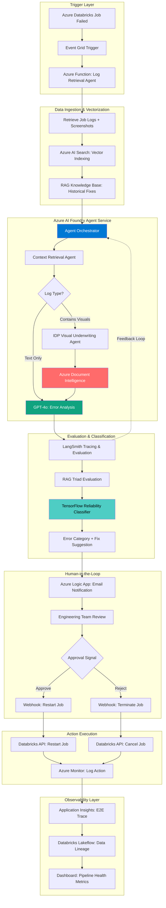
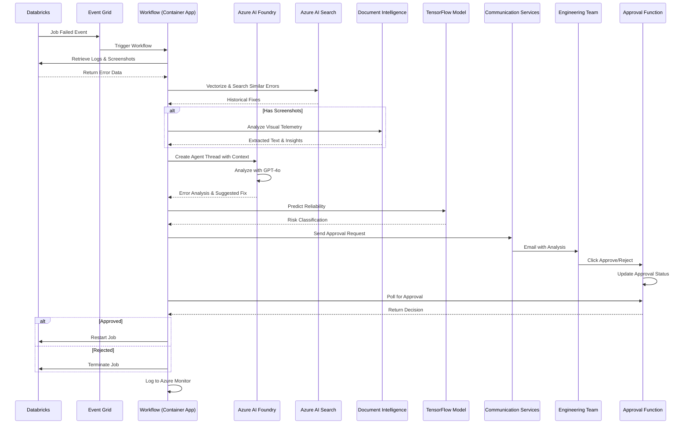
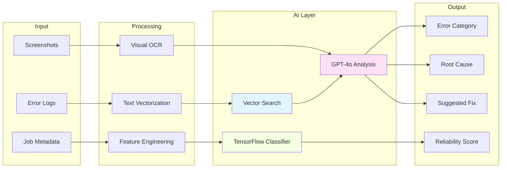
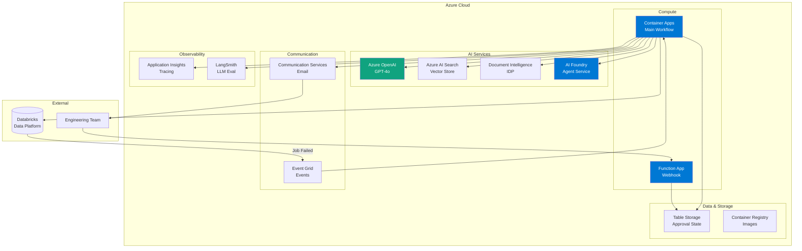
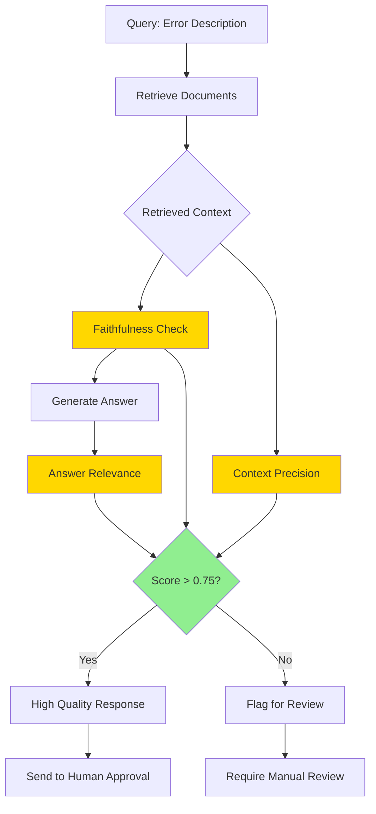

# Architecture Diagram

## System Architecture Diagram (Mermaid)

Copy and paste this into any Mermaid-compatible viewer (GitHub, VS Code with Mermaid extension, mermaid.live)

## Component Interaction Flow

## Data Flow Diagram

## Deployment Architecture

## RAG Triad Evaluation Flow

---

## View These Diagrams

1. **GitHub**: Diagrams render automatically in README files
2. **VS Code**: Install "Markdown Preview Mermaid Support" extension
3. **Online**: Copy to https://mermaid.live
4. **Documentation**: Use in Confluence, Notion (with Mermaid support)
